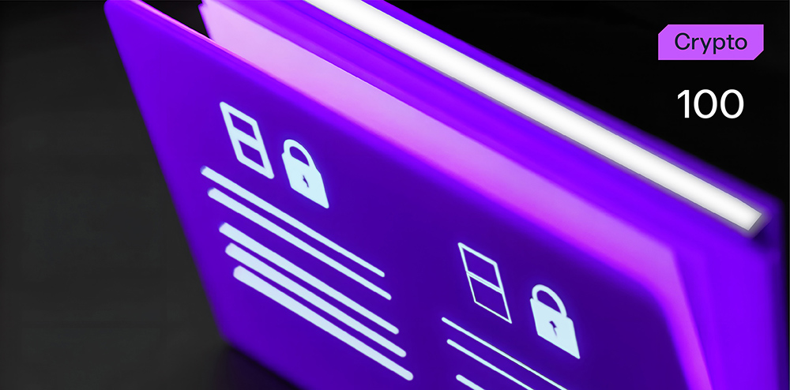

# Game of Spy



**Формат флага/Flag format**: solar{}

**Файлы/Files**: [task.zip](task.zip)
---

**Описание**:
---
 Мой друг написал мне странное сообщение. Я все не могу понять, где же этот секрет?! Поможешь?

**Description**:
---
 My friend wrote me a strange message. I still can't understand, where is this secret?! Will you help?

**Идея задачи**:
---

Идея задачи заключается в том, что представленный в сообщении смайлик — это контейнер, в котором скрыт флаг. Внутри смайлика помещается до 3000 символов из-за кодировки Unicode.

**Problem idea**:
---

The idea of the problem is that the emoticon presented in the message is a container in which the flag is hidden. Up to 3000 characters can fit inside the emoticon due to Unicode encoding.

**Решение**:
---

Необходимо проанализировать сообщение и понять, что что-то не так с эмодзи. При помощи разных инструментов (пример: https://emoji.paulbutler.org) можно раздекодить и получить сообщение в двоичной кодировке:

```
01110011 01101111 01101100 01100001 01110010 01111011 00110001 01011111 01101100 00110000 01110110 00110011 01011111 01110101 01101110 00110001 01100011 00110000 01100100 00110011 01011111 01110011 00110000 00110000 01011111 01101101 00110100 01100011 00110100 01111101
```

Далее переводим его из двоичного вида и получаем флаг:

solar{1_l0v3_un1c0d3_s00_m4c4}


**Solution**:
---

You need to analyze the message and understand that something is wrong with the emoji. Using different tools (example: https://emoji.paulbutler.org) you can decode and get the message in binary encoding:

```
01110011 01101111 01101100 01100001 01110010 01111011 00110001 01011111 01101100 00110000 01110110 00110011 01011111 01110101 01101110 00110001 01100011 00110000 01100100 00110011 01011111 01110011 00110000 00110000 01011111 01101101 00110100 01100011 00110100 01111101
```

Then we translate it from binary form and get the flag:

solar{1_l0v3_un1c0d3_s00_m4c4}