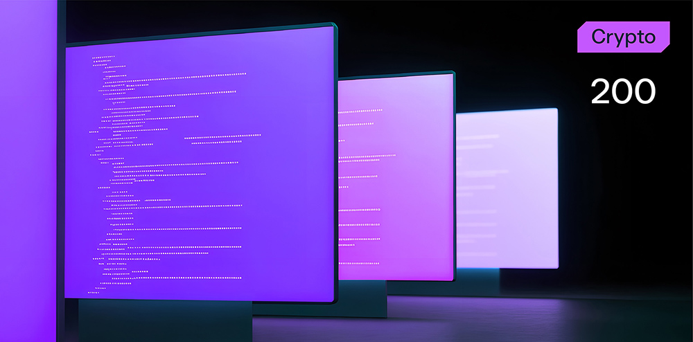

# Silent Cypher



**Формат флага/Flag format**: solar{}

**Файлы/Files**: [cipher.zip](cipher.zip)
---

**Описание**:
---
 Вы получили анонимное письмо, содержащее только одно вложение. Сможете ли вы решить его?

**Description**:
---
 You received an anonymous letter containing just one attach. Can you solve it?

**Идея задачи**:
---
Простенькая задача на XOR - в исходном сообщении содержится ключ.

**Problem idea**:
---
A simple XOR problem - the original message contains the key.

**Решение**:
---
Во вложении содержится строка:

```
SSBhbSBsZWZ0IGJlaGluZCBidXQgbmV2ZXIgc2VlbiwKQSBoaWRkZW4gcGF0aCB3aGVyZSBub25lIGhhcyBiZWVuLgpUaHJvdWdoIG1lLCBpbnRydWRlcnMgY29tZSBhbmQgZ28sClVuc2VlbiwgdW5rbm93buKAlHlldCBpbiBjb250cm9sLgpXaGF0IGFtIEk/
```

Строка закодирована в base64, можно быстро расшифровать и получить загадку:

*I am left behind but never seen,*
*A hidden path where none has been.*
*Through me, intruders come and go,*
*Unseen, unknown and yet in control.*
*What am I?*

Как не сложно догадаться, ответ на загадку - "backdoor", только надо поиграться еще с регистром и получим ключ к шифру "BACKDOOR".

Далее пишем простенький скрипт для дешифровки:

```
def xor_decrypt_bytes(data, key):
    return bytes([b ^ key[i % len(key)] for i, b in enumerate(data)])

key = b"BACKDOOR"

with open("cipher.bin", "rb") as f:
    encrypted_text = f.read()

decrypted_text = xor_encrypt_decrypt_bytes(encrypted_text, key)
print(decrypted_text.decode())
```

И получаем желанный флаг:
solar{Xo4_1s_3aSy_aS_y04_4n0w}


**Solution**:
---
The attachment contains the string:

```
SSBhbSBsZWZ0IGJlaGluZCBidXQgbmV2ZXIgc2VlbiwKQSBoaWRkZW4gcGF0aCB3aGVyZSBub25lIGhhcyBiZWVuLgpUaHJvdWdoIG1lLCBpbnRydWRlcnMgY29tZSBhbmQgZ28sClVuc2VlbiwgdW5rbm93buKAlHlldCBpbiBjb250cm9sLgpXaGF0IGFtIEk/
```

The string is encoded in base64, you can quickly decrypt it to get the riddle:

*I am left behind but never seen,*
*A hidden path where none has been.*
*Through me, intruders come and go,*
*Unseen, unknown and yet in control.*
*What am I?*

As you can easily guess, the answer to the riddle is "backdoor", but we still need to play with the register and get the key to the "BACKDOOR" cipher.

Next, we write a simple script for decryption:

```
def xor_decrypt_bytes(data, key):
return bytes([b ^ key[i % len(key)] for i, b in enumerate(data)])

key = b"BACKDOOR"

with open("cipher.bin", "rb") as f:
encrypted_text = f.read()

decrypted_text = xor_encrypt_decrypt_bytes(encrypted_text, key)
print(decrypted_text.decode())
```

And we get the desired flag:
solar{Xo4_1s_3aSy_aS_y04_4n0w}