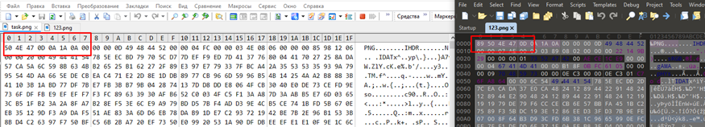

# Old Times

**Формат флага/Flag format**: solar{}

**Файлы/Files**: [old.zip](old.zip)
---
**Описание**:
---
У меня был крутой скриншот, но с ним, что – то стряслось...

**Description**:
---
I had a cool screenshot, but something happened to it...

**Идея задачи**:
---
Намеренно поврежденный скриншот, отсутствуют первые два символа в пнг файле.

**Problem idea**:
---
Intentionally damaged screenshot, first two characters are missing in png file.

**Решение**:
---
Необходимо открыть любой другой ПНГ файл и сравнить их, для того, чтобы решить таск.

Сравниваем header'ы

Дописываем необходимые данные в нашу картинку и получаем исходное изображение, в котором содержится флаг:

Флаг: solar{s4m5_w4s_c001}

**Solution**:
---
It is necessary to open any other PNG file and compare them in order to solve the task.

Compare headers

We add the necessary data to our image and get the original image, which contains the flag:

Flag: solar{s4m5_w4s_c001}