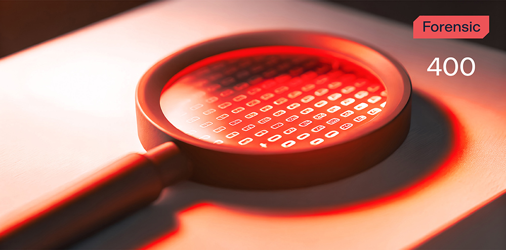
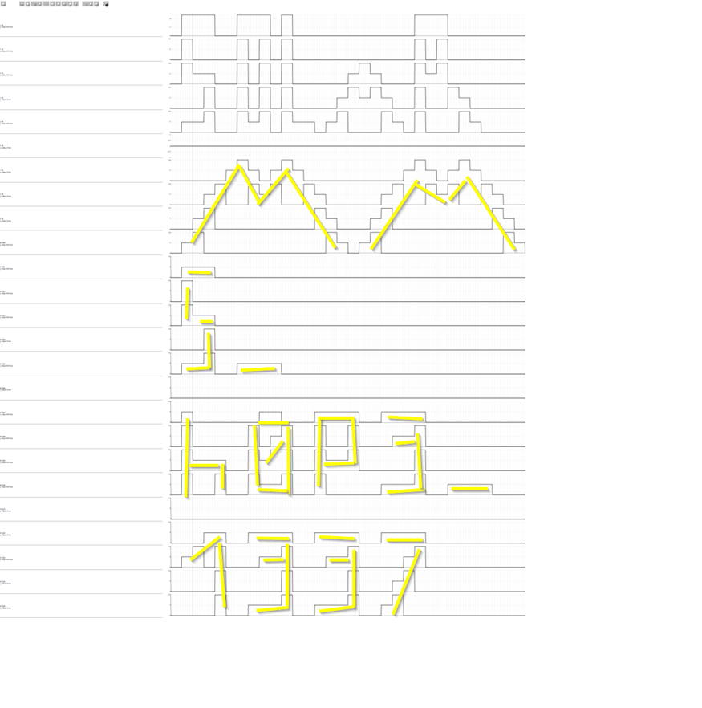

# Hello from electricity

**Формат флага/Flag format**: solar{}

**Файлы/Files**: [bzz.zip](bzz.zip)
---

**Описание**:
---
На электроподстанции зафиксирована странная активность. 
Один из операторов явно передал в сигнале нечто большее, чем просто напряжение...
Разгадай импульсный привет — и найди, что скрывается в волнах!

**Description**: 
---
Strange activity has been detected at the electrical substation.
One of the operators has clearly transmitted more than just voltage in the signal...
Unravel the pulse greeting - and find what's hidden in the waves!

**Решение**:
---
Из дампа трафика необходимо восстановить два файла:

COMTRADE_faultan.cfg и COMTRADE_faultan.dat. 

Далее можно было найти подсказку (либо в самом дампе, либо по наименованиям файлов) на сайт, который нам может помочь это расшифровать - https://faultan.ru/osc_viewer/
Отправив туда оба файла мы получим осциллограмму, где будет виден флаг:

Флаг: solar{mms_h0p3_1337}

**Solution**:
---
From the traffic dump, two files need to be restored:

COMTRADE_faultan.cfg and COMTRADE_faultan.dat.

Then you could find a hint (either in the dump itself or by the file names) on a site that can help us decipher this - https://faultan.ru/osc_viewer/
By sending both files there, we will get an oscillogram where the flag will be visible:

Flag: solar{mms_h0p3_1337}