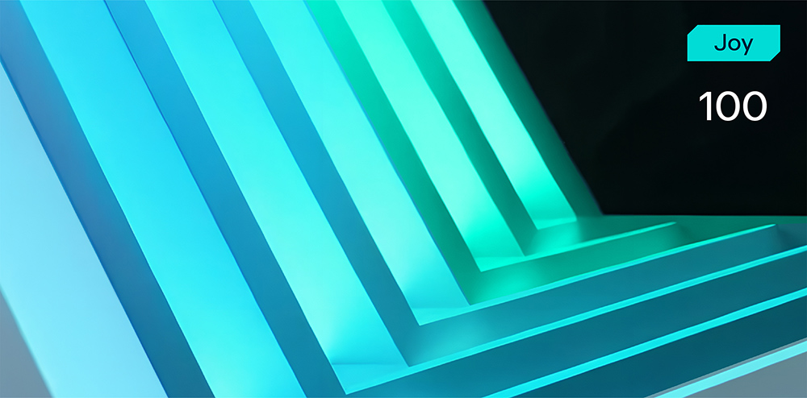

# Emoji Talk

**Формат флага/Flag format**: solar{}

**Файлы/Files**: [task.zip](task.zip)
---
**Описание**:
---
Кажется, кто-то слишком любит эмодзи 😅
Сообщение, которое вы ищете, явно не похоже на обычный текст... Но, может быть, 😸 + 🎉 + 🐍 — это вообще не эмоции, а что-то зашифрованное?

**Description**: 
---
Looks like someone loves emojis too much 😅
The message you're looking for clearly doesn't look like regular text... But maybe 😸 + 🎉 + 🐍 aren't emotions at all, but something encrypted?

**Решение**:
---
Нам всегда известные первые 6 символов флага - solar{, согласно им можно догадаться, что:

🐍 - snake (s)
🐙- octopus (o)
🦁 - lion (l)
🍎 - apple (a)
🤖 - robot (r)
🧩 - {

Остальное дальше логически можно разобрать и получить флаг:

solar{3moji_f0r_c0m4un1cat10n}

**Solution**:
---
We always know the first 6 symbols of the flag - solar{, according to them we can guess that:

🐍 - snake (s)
🐙- octopus (o)
🦁 - lion (l)
🍎 - apple (a)
🤖 - robot (r)
🧩 - {

The rest can be logically parsed and get the flag:

solar{3moji_f0r_c0m4un1cat10n}