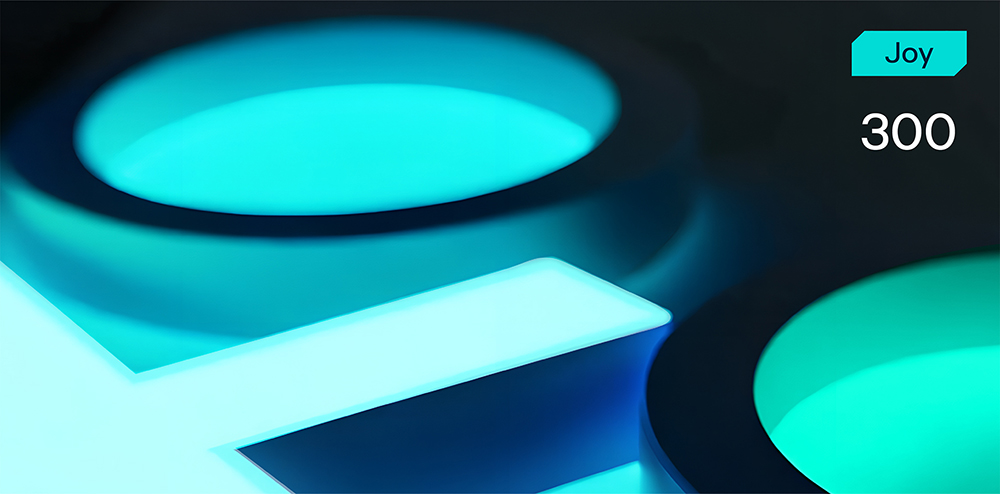

# Audio Lies



**Формат флага/Flag format**: solar{}

**Файлы/Files**: [task.zip](task.zip)
---
**Описание**:
---
Запись выглядит пустой. Но если вы умеете слушать, вы можете услышать больше, чем тишину...

**Description**:
---
The recording looks empty. But if you know how to listen, you might hear more than silence...

**Решение**:
---
Азбукой Морзе закодировано сообщение, можно прогнать даже через онлайн-декодер и он выдаст зашифрованное сообщение:

```
    HELLO,FRIEND.YEAH,YOUFOUNDIT.THEFLAGISSOLARM0RSE_0N_AIRINLOWERCASE.ANDDONTFORGETABOUTBRACES.
```

Отсюда уже аккуратно достаем флаг: solar{m0rse_0n_air}

**Solution**:
---
The message is encoded in Morse code, you can even run it through an online decoder and it will give you an encrypted message:

```
    HELLO,FRIEND.YEAH,YOUFOUNDIT.THEFLAGISSOLARM0RSE_0N_AIRINLOWERCASE.ANDDONTFORGETABOUTBRACES.
```

From here we carefully get the flag: solar{m0rse_0n_air}