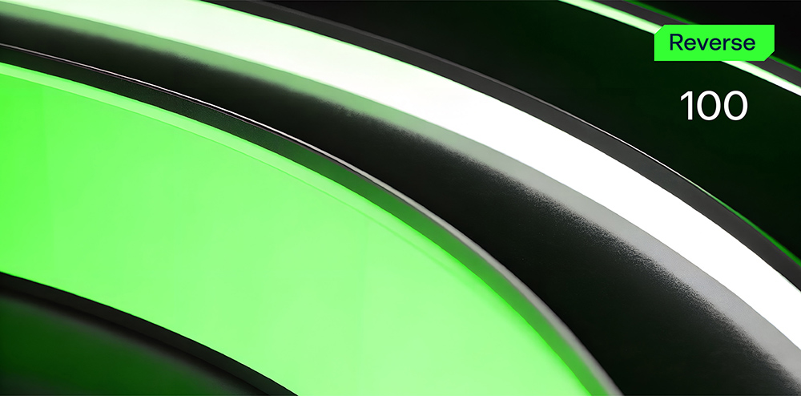

# Baby Rev

**Формат флага/Flag format**: solar{}

**Файлы/Files**: [baby.zip](baby.zip)
---
**Описание**: 
---
Первый реверс никогда не забывается... Постарайтесь понять, какая информация нужна этому малышу.

**Description**: 
---
The first reverse is never forgotten... Try to figure out what input this baby needs.

**Решение**:
---
Прогоняем бинарь через strings, находим магическое слово, которое и будет являться флагом - и все.

Флаг: solar{y3ah_easiest_w@rmup}

**Solution**:
---
We run the binary through strings, find the magic word, which will be the flag - and that's it.

Flag: solar{y3ah_easiest_w@rmup}
