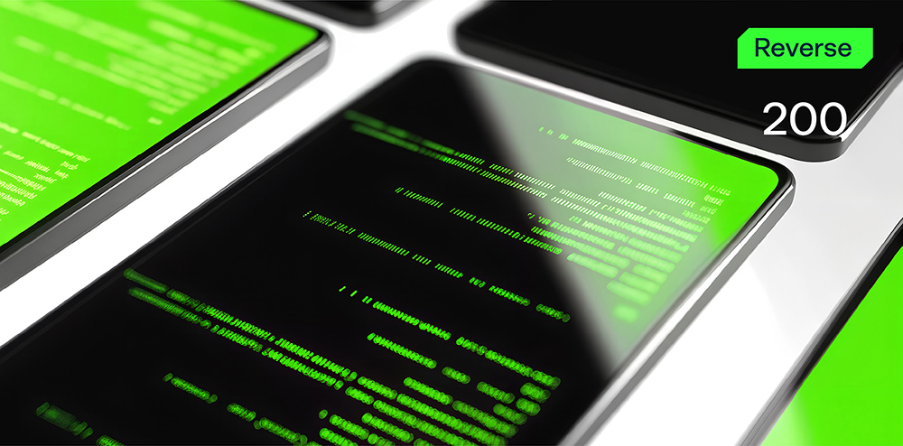

# The Secret Ingridient

**Формат флага/Flag format**: solar{}

**Файлы/Files**: [chef.zip](chef.zip)
---
**Описание**: 
---
Легендарный шеф-повар оставил после себя таинственный двоичный файл, который скрывает его самое важное творение: секретный ингредиент. Согласно кухонным журналам, он раскрывает секрет только тем, кто знает пароль. Но программа скомпилирована, и рецепт хорошо защищен...

**Description**: 
----
The legendary chef left behind a mysterious binary that hides his most important creation: the secret ingredient.
According to the kitchen logs, it only reveals the secret to those who know the passphrase. But the program is compiled, and the recipe is well protected...

**Решение**:
---
Реверсим приложение, находим, что пароль для входа "letmein" и вводим его при запуске secret.exe

Флаг: solar{th3_s3cr3t_1s_p4rsley}

**Solution**:
---
Reverse the application, find that the login password is "letmein" and enter it when launching secret.exe

Flag: solar{th3_s3cr3t_1s_p4rsley}