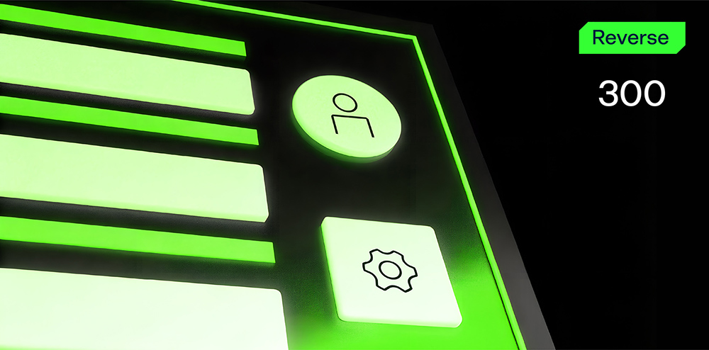

# Math Pass

**Формат флага/Flag format**: solar{}

**Файлы/Files**: [math.zip](math.zip)
---
**Описание**: 
---
Простой двоичный код - введите 5 цифр. Если повезет - получите флаг. Но шансы явно не на вашей стороне.

**Description**: 
---
Simple binary - enter 5 digits. If you're lucky - you get a flag. But the odds are clearly no on your side.

**Решение**:
---
Нужно проанализировать приложение, понять, как оно работает и по итогу найти такое 5 значное число, сумма которого будет 17, а произведение 180. 
Нюанс - нужно отсортировать по возрастанию.

Флаг: solar{12356}

**Solution**:
---
You need to analyze the application, understand how it works and ultimately find a 5-digit number whose sum is 17 and the product is 180. 
The nuance is that you need to sort it in ascending order.

Flag: solar{12356}