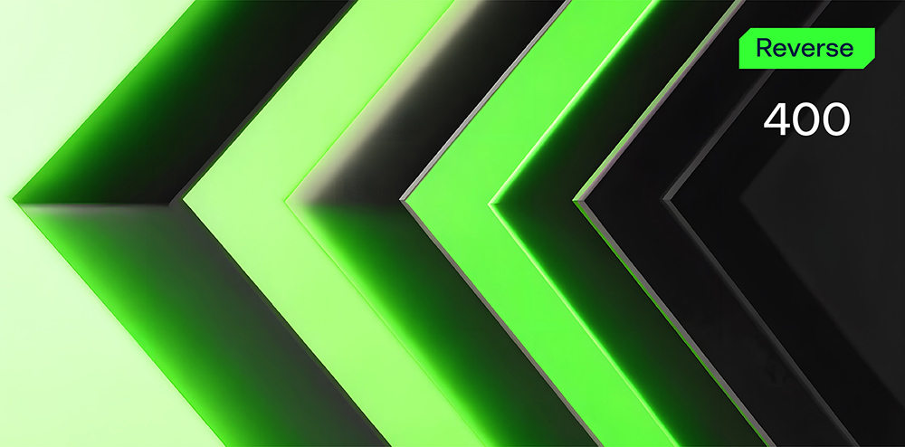

# String Sort

**Формат флага/Flag format**: solar{}

**Файлы/Files**: [string.zip](string.zip)
---
**Описание**: 
---
Двоичный файл просит вас ввести строку. Если вы угадали, вы получаете флаг. Никаких подсказок. Время посмотреть, что внутри.

**Description**: 
---
The binary asks you to enter a string. If you guessed correctly, you get a flag. No hints. Time to see what`s inside.

**Решение**:
---
Нужно понять логику приложения и алгоритма, использующегося внутри. 
Логика в том, что нужна строка из 6 символов, с повторениями и определенным символом на определенном месте, это же и будет флагом. 
Нюанс - необходимо отсортировать по возрастанию.

Флаг: solar{aehrzz}

**Solution**:
---
You need to understand the logic of the application and the algorithm used inside. 
The logic is that you need a string of 6 characters, with repetitions and a certain character in a certain place, this will also be the flag. 
The nuance is that you need to sort in ascending order.

Flag: solar{aehrzz}