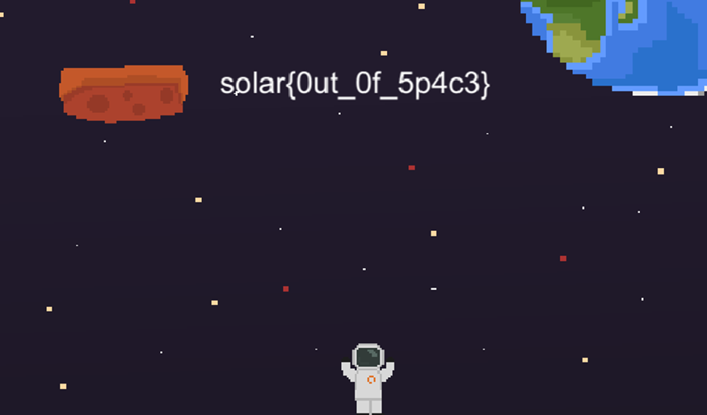

# Space Jumper

**Формат флага/Flag format**: solar{}

**Файлы/Files**: [Space Jumper.zip](Space_Jumper.zip)
---
**Описание**: 
---
Поможешь космонавту допрыгать до ципра?

**Description**: 
---
Will you help the astronaut jump to the CIPR?

**Решение**:
---
Можно полазить по файлам, подумать, как работают алгоритмы, какая нужна платформа и что на ней нужно сделать и получить флаг (1-я платформа, 30 раз пропрыгать на ней). Либо можно через strings полазить по файлам и во вложенных файлах (Space_Jumper_Data/level0) также найти искомый флаг.

Флаг: solar{0ut_0f_5p4c3}

**Solution**:
---
You can browse through the files, think about how the algorithms work, what platform is needed and what needs to be done on it and get the flag (1st platform, jump on it 30 times). Or you can browse through the files via strings and also find the required flag in the attached files (Space_Jumper_Data/level0).

Flag: solar{0ut_0f_5p4c3}