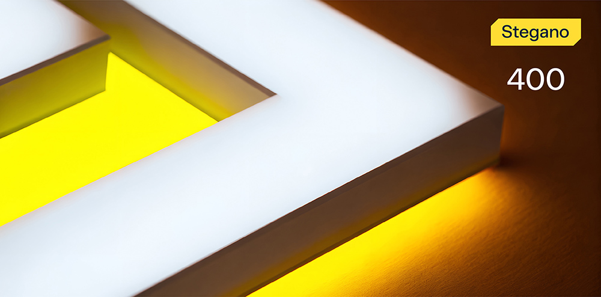
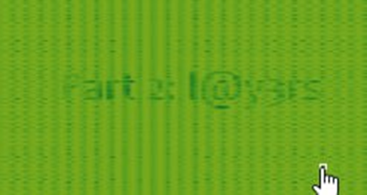

# The Secret of the Invisible Clown



**Формат флага/Flag format**: solar{}

**Файлы/Files**: [conf.zip](conf.zip)
---
**Описание**: 
---
В цифровом цирке города Штегбург творится что-то странное... Легендарный клоун Бибо исчез во время своего фирменного трюка - «Исчезновение в картине».
Перед тем, как испариться, он успел прошептать: «Тот, кто узнает мои секреты, получит не только мой нос, но и ключ от всех гримерок!»

**Description**: 
---
Something strange is happening in the digital circus of the town of Stegburg... The legendary clown Bibo disappeared during his signature trick - "Disappearing into the picture".
Before evaporating, he managed to whisper: "Whoever finds my secrets will get not only my nose, but also the key to all the dressing rooms!"

**Решение**:
---
Флаг разбит на 4 части.

Первая часть в картинке (lsb-преобразование) (*solar{h1dd3N*)

Вторая часть - в wav файле (нужно прочитать спектрограмму). (Типы Spek и тп.)



*Part2: _l@y3r$*

Третья часть - в метаданных pdf.

```
10 0 obj
<< /Length 36 /Filter /FlateDecode >>
stream
UGFydDM6XzNuYzBkM2Q=
endstream
endobj
```

*Part3: _3nc0d3d*

Четвертая в архиве, который запаролен на ключе, состоящем из 3х предыдущих кусков флага (без solar{)

*Part4:_D@ta}*

Флаг: solar{h1dd3N_l@y3r$_3nc0d3d_D@ta}

**Solution**:
---
The flag is divided into 4 parts.

The first part is in the picture (lsb-transformation) (*solar{h1dd3N*)

The second part is in the wav file (you need to read the spectrogram). (Spek types, etc.)


*Part2: _l@y3r$*

The third part is in the pdf metadata.

```
10 0 obj
<< /Length 36 /Filter /FlateDecode >>
stream
UGFydDM6XzNuYzBkM2Q=
endstream
endobj
```

*Part3: _3nc0d3d*

The fourth in the archive, which is password-protected on the key, consisting of the 3 previous pieces of the flag (without solar{)

*Part4:_D@ta}*

Flag: solar{h1dd3N_l@y3r$_3nc0d3d_D@ta}