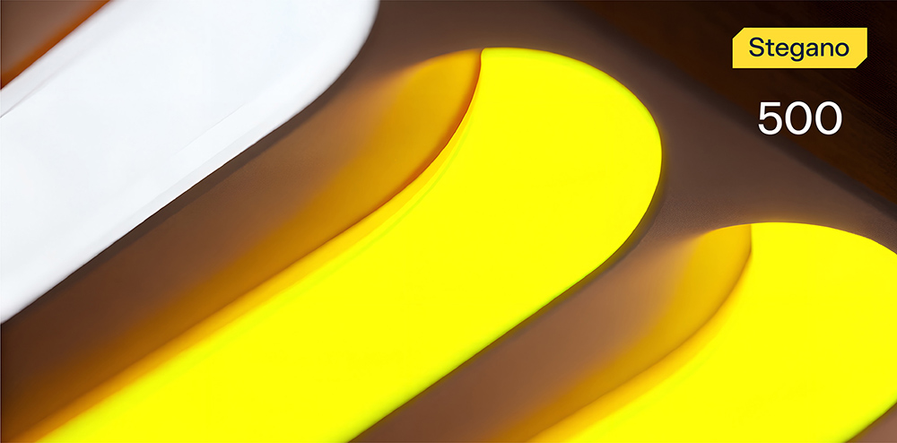

# StrangePic



**Формат флага/Flag format**: solar{}

**Файлы/Files**: [strange.zip](strange.zip)
---
**Описание**:
---
В этой картинке есть что-то странное. Можете догадаться?

**Description**:
---
There's something weird about this picture. Can you figure it out?

**Решение**:
---
В основе лежит проблема через дельта-кодирование между значениями серого. Нужно разобраться, какой начальный цвет был (240), где начинается сама строка с флагом и т.п.

Далее можно написать скрипт, который поможет нам достать наш флаг:

```
from PIL import Image

img = Image.open("strange.png")
pixels = img.load()

start_x, start_y = 10, 10
flag_len = 29
base_value = 240

grays = []
for i in range(flag_len):
    r, g, b = pixels[start_x + i, start_y]
    grays.append(r)

deltas = [ (grays[0] - base_value) % 256 ]
for i in range(1, len(grays)):
    delta = (grays[i] - grays[i - 1]) % 256
    deltas.append(delta)

flag_bytes = [deltas[0]]
for i in range(1, len(deltas)):
    flag_bytes.append((flag_bytes[i-1] + deltas[i]) % 256)

flag = ''.join([chr(b) for b in flag_bytes])

print("Recovered flag:", flag)
```

Флаг: solar{st3gan0_1s_v3ry_s1mpl3}

**Solution**:
---
The underlying problem is through delta encoding between gray values. You need to figure out what the initial color was (240), where the line with the flag itself starts, etc.

Next, we can write a script that will help us get our flag:

```
from PIL import Image

img = Image.open("strange.png")
pixels = img.load()

start_x, start_y = 10, 10
flag_len = 29
base_value = 240

grays = []
for i in range(flag_len):
    r, g, b = pixels[start_x + i, start_y]
    grays.append(r)

deltas = [ (grays[0] - base_value) % 256 ]
for i in range(1, len(grays)):
    delta = (grays[i] - grays[i - 1]) % 256
    deltas.append(delta)

flag_bytes = [deltas[0]]
for i in range(1, len(deltas)):
    flag_bytes.append((flag_bytes[i-1] + deltas[i]) % 256)

flag = ''.join([chr(b) for b in flag_bytes])

print("Recovered flag:", flag)
```

Flag: solar{st3gan0_1s_v3ry_s1mpl3}