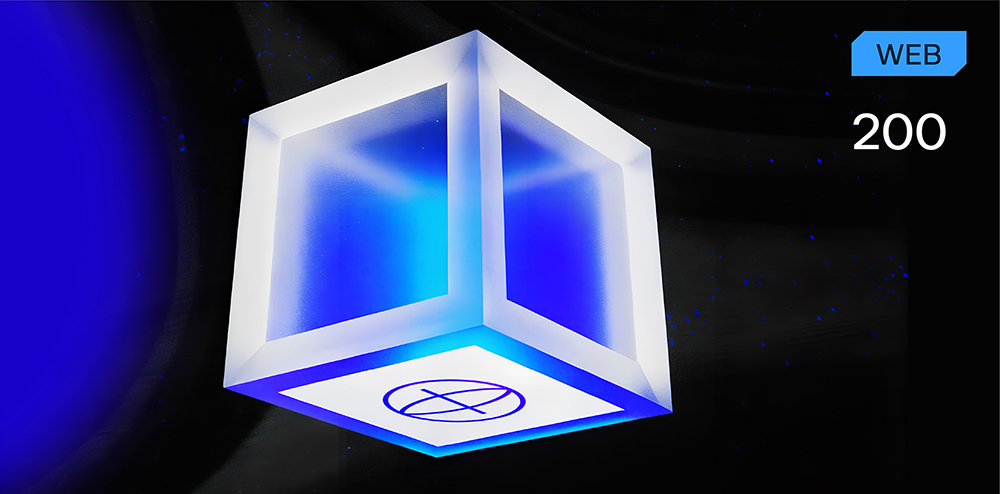

# YetAnotherLoginForm

**Формат флага/Flag format**: solar{}

**Файлы/Files**: [yalf.zip](yalf.zip)
---
**Описание**:
---
Еще одна форма входа… но разработчики уверены, что на этот раз ее невозможно взломать. 

Ваша цель: проанализировать код, найти и использовать уязвимости и отправить их идентификаторы CWE в том порядке, в котором вы их используете.

 Ни один флаг не скрыт в коде или пользовательском интерфейсе. 
 
 Будет принят только ваш анализ уязвимости. 
 
 Формат флага: solar{CWE-XX}

**Description**: 
---
Another login form… but the developers are confident that this time it is unhackable.

Your goal: analyze the code, find and exploit vulnerabilities, and submit their CWE IDs in the order you use them.

No flags are hidden in the code or UI.

Only your vulnerability analysis will be accepted.

Flag format: solar{CWE-XX}

**Решение**:
---
Необходимо было либо вручную, либо при помощи специализированных инструментов проанализировать исходный код, найти уязвимость и указать в виде флага CWE данной уязвимости.

Флаг: solar{CWE-89}

**Solution**:
---
It was necessary to either manually or with the help of specialized tools analyze the source code, find the vulnerability and indicate it as a CWE flag for this vulnerability.

Flag: solar{CWE-89}